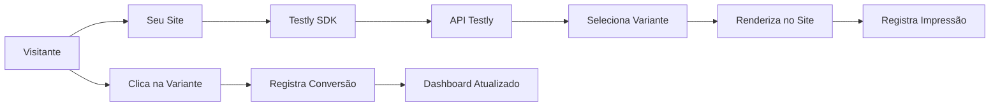

## O que é o Testly?

O **Testly** é uma plataforma completa de testes A/B que permite que você otimize suas conversões sem precisar ser um especialista em estatística ou programação complexa.

<CardGroup cols={2}>
  <Card title="Fácil de Usar" icon="sparkles">
    Interface intuitiva para criar experimentos em minutos
  </Card>
  <Card title="SDK Plug-and-Play" icon="plug">
    Apenas uma linha de código para começar a testar
  </Card>
  <Card title="Resultados em Tempo Real" icon="chart-line">
    Monitore impressões e conversões instantaneamente
  </Card>
  <Card title="Statistically Sound" icon="calculator">
    Métricas confiáveis para tomar decisões baseadas em dados
  </Card>
</CardGroup>

---

## Por que usar testes A/B?

Testes A/B são a forma mais eficaz de melhorar suas conversões de forma mensurável. Em vez de adivinhar o que funciona melhor, você **testa e comprova**.

<Accordion title="Exemplo prático">
  Imagine que você tem um botão de CTA (Call-to-Action) em sua landing page com o texto "Comprar Agora".

  Você suspeita que "Começar Gratuitamente" pode converter melhor, mas não tem certeza.

  Com o Testly, você:

  1. Cria duas variantes (A e B)
  2. O SDK distribui aleatoriamente os visitantes entre as versões
  3. Você monitora qual versão gera mais conversões
  4. Toma uma decisão baseada em dados reais, não em suposições
</Accordion>

### Benefícios comprovados

<AccordionGroup>
  <Accordion title="Aumento de conversões" icon="arrow-trend-up">
    Empresas que fazem testes A/B regularmente veem aumentos de 20-30% em suas taxas de conversão.
  </Accordion>
  <Accordion title="Insights sobre seus usuários" icon="lightbulb">
    Entenda melhor o comportamento e preferências do seu público.
  </Accordion>
  <Accordion title="Redução de riscos" icon="chart-pie">
    Valide mudanças antes de implementá-las para todos os usuários.
  </Accordion>
  <Accordion title="ROI mensurável" icon="money-bill-trend-up">
    Cada teste fornece dados concretos sobre o retorno do investimento.
  </Accordion>
</AccordionGroup>

---

## Como funciona?

O Testly torna o processo de teste A/B extremamente simples:

<Steps>
  <Step title="Crie sua conta">
    Registre-se gratuitamente na plataforma Testly em poucos segundos.
  </Step>
  <Step title="Configure seu experimento">
    No dashboard, crie um novo experimento e defina suas variantes (A, B, C...).

    Cada variante pode ter:

    - HTML customizado
    - CSS personalizado
    - JavaScript interativo
  </Step>
  <Step title="Implemente o SDK">
    Adicione uma única linha de código no seu site:

    ```html
    <script src="https://testly/flow.js?experimentId=SEU_ID&elementId=container&apiKey=SUA_KEY"></script>
    ```
  </Step>
  <Step title="Monitore os resultados">
    Acompanhe em tempo real:

    - **Impressões**: quantas pessoas viram cada variante
    - **Conversões**: quantas pessoas clicaram/converteram
    - **Taxa de conversão**: porcentagem de conversão por variante
  </Step>
  <Step title="Tome decisões baseadas em dados">
    Quando tiver significância estatística, implemente a variante vencedora para 100% dos usuários.
  </Step>
</Steps>

---

## Arquitetura do Sistema

Entenda como o Testly funciona por baixo dos panos:



### Fluxo detalhado

<Tabs>
  <Tab title="Primeira Visita">
    1. **Usuário acessa a página**: O visitante entra no seu site pela primeira vez
    2. **SDK carrega**: O script do Testly é executado
    3. **Chamada à API**: SDK solicita uma variante para o experimento
    4. **Seleção aleatória**: API escolhe uma variante de forma aleatória e uniforme
    5. **Armazenamento local**: SDK salva a variante no `localStorage` do navegador
    6. **Renderização**: Variante é injetada no elemento especificado
    7. **Registro de impressão**: API registra que o usuário viu essa variante
    8. **ID persistente**: Um `userId` único é gerado e armazenado localmente
  </Tab>
  <Tab title="Visitas Subsequentes">
    1. **Usuário retorna**: O mesmo visitante volta ao site
    2. **SDK verifica cache**: Busca a variante armazenada no `localStorage`
    3. **Mesma experiência**: SDK renderiza a mesma variante anterior
    4. **Sem nova impressão**: Não registra impressão duplicada
    5. **Consistência**: Usuário vê sempre a mesma variante durante todo o experimento
  </Tab>
  <Tab title="Conversão">
    1. **Ação do usuário**: Visitante clica na variante renderizada
    2. **Evento capturado**: SDK detecta o clique no elemento
    3. **Registro de conversão**: API registra a conversão para aquela variante
    4. **Atualização em tempo real**: Dashboard atualiza as métricas instantaneamente
    5. **Cálculo automático**: Taxa de conversão é recalculada
  </Tab>
</Tabs>

---

## Principais Conceitos

### Experimento

Um **experimento** é o container principal onde você configura seu teste A/B. Cada experimento possui:

- **ID único**: Identificador do experimento
- **Nome**: Título descritivo
- **Status**: Ativo ou Inativo
- **Variantes**: As diferentes versões que serão testadas

### Variante

Uma **variante** é cada versão diferente que será testada no experimento:

- **Variante A (Controle)**: Versão original/atual
- **Variante B, C, D...**: Versões alternativas

Cada variante contém:

- **HTML**: Estrutura do elemento
- **CSS**: Estilos personalizados (opcional)
- **JavaScript**: Comportamento interativo (opcional)

<Tip>
  O ideal é criar de 2 a 4 variantes por experimento. Muitas variantes podem diluir seus resultados e exigir muito mais tráfego para atingir significância estatística.
</Tip>

### Impressão

Uma **impressão** é registrada quando um usuário vê uma variante pela primeira vez. O SDK garante que:

- Apenas a primeira visualização é contada
- Recarregamentos de página não geram novas impressões
- Cada usuário é contado apenas uma vez

### Conversão

Uma **conversão** ocorre quando o usuário executa a ação desejada - geralmente um clique no elemento renderizado.

<Note>
  Atualmente, o Testly rastreia conversões através de cliques nos elementos renderizados. Suporte para eventos personalizados está em desenvolvimento.
</Note>

### Taxa de Conversão

A **taxa de conversão** é calculada como:

```
Taxa de Conversão = (Conversões / Impressões) × 100%
```

Esta métrica indica qual variante está performando melhor.

---

## Casos de Uso

O Testly é perfeito para testar diversos elementos do seu site:

<CardGroup cols={2}>
  <Card title="Botões de CTA" icon="hand-pointer">
    Teste textos, cores, tamanhos e posicionamento de call-to-actions
  </Card>
  <Card title="Headlines" icon="heading">
    Descubra qual título gera mais engajamento e conversões
  </Card>
  <Card title="Imagens" icon="image">
    Compare diferentes imagens de produto ou hero sections
  </Card>
  <Card title="Formulários" icon="list-check">
    Otimize campos, labels e botões de envio
  </Card>
  <Card title="Pricing" icon="dollar-sign">
    Teste diferentes estruturas de preço e ofertas
  </Card>
  <Card title="Social Proof" icon="users">
    Compare depoimentos, badges e elementos de confiança
  </Card>
  <Card title="Layouts" icon="table-cells">
    Teste diferentes disposições de elementos na página
  </Card>
  <Card title="Copy" icon="pen">
    Otimize textos de descrição e proposta de valor
  </Card>
</CardGroup>

---

## Requisitos Técnicos

<AccordionGroup>
  <Accordion title="Navegadores Suportados" icon="browser">
    - Chrome 90+
    - Firefox 88+
    - Safari 14+
    - Edge 90+
    - Opera 76+

    O SDK utiliza APIs modernas do JavaScript e localStorage.
  </Accordion>
  <Accordion title="Frameworks Compatíveis" icon="code">
    - HTML/CSS/JavaScript puro
    - React 16.8+ (com hooks)
    - Vue.js 2 e 3
    - Angular 10+
    - Next.js
    - Nuxt.js
    - Qualquer framework que permita inserção de scripts
  </Accordion>
  <Accordion title="Sistemas de Tag Management" icon="tags">
    - Google Tag Manager
    - Adobe Launch
    - Segment
    - Tealium
  </Accordion>
  <Accordion title="Hospedagem" icon="server">
    Funciona em qualquer tipo de hospedagem:

    - Sites estáticos
    - WordPress
    - Shopify
    - Webflow
    - Custom applications
    - Single Page Applications (SPAs)
  </Accordion>
</AccordionGroup>

---

## Segurança e Privacidade

<CardGroup cols={2}>
  <Card title="Dados Anônimos" icon="user-secret">
    Não coletamos informações pessoais dos visitantes
  </Card>
  <Card title="GDPR Compliant" icon="shield-check">
    Em conformidade com regulamentações de privacidade
  </Card>
  <Card title="API Keys Seguras" icon="key">
    Autenticação robusta via chaves únicas
  </Card>
  <Card title="HTTPS Only" icon="lock">
    Todas as comunicações são criptografadas
  </Card>
</CardGroup>

<Warning>
  Nunca exponha sua API Key em código público (GitHub, fóruns, etc.). Trate-a como uma senha.
</Warning>

---

## Limitações Atuais

Queremos ser transparentes sobre as limitações da versão atual:

- **Tráfego mínimo recomendado**: 1.000+ visitantes/mês por experimento
- **Eventos customizados**: Ainda não suportado (em desenvolvimento)
- **Testes multivariados**: Limitado a A/B/C/D (máximo 4 variantes)
- **Segmentação avançada**: Não disponível ainda
- **Integração analytics**: Em desenvolvimento

<Note>
  Estamos constantemente melhorando a plataforma. Confira nosso [roadmap](#) para ver o que está por vir!
</Note>

---

## Próximos Passos

Pronto para começar? Siga estes passos:

<Steps>
  <Step title="Crie sua conta">
    [Registre-se gratuitamente](https://testly.com/signup) na plataforma
  </Step>
  <Step title="Leia o Quickstart">
    Siga nosso [Guia Rápido de Implementação](/quickstart) para adicionar o SDK
  </Step>
  <Step title="Crie seu primeiro experimento">
    Acesse o dashboard e configure suas variantes
  </Step>
  <Step title="Monitore resultados">
    Acompanhe métricas em tempo real e tome decisões baseadas em dados
  </Step>
</Steps>

<Card title="Comece Agora" icon="rocket" href="/quickstart">
  Vá para o Guia Rápido e implemente seu primeiro teste A/B em 5 minutos
</Card>

---

## Precisa de Ajuda?

<CardGroup cols={3}>
  <Card title="Documentação" icon="book" href="/docs">
    Explore guias detalhados
  </Card>
  <Card title="Exemplos" icon="code" href="/examples">
    Veja implementações reais
  </Card>
  <Card title="Suporte" icon="life-ring" href="mailto:support@testly.com">
    Fale com nosso time
  </Card>
</CardGroup>

<Tip>
  Junte-se à nossa [comunidade no Discord](#) para trocar experiências com outros usuários!
</Tip>